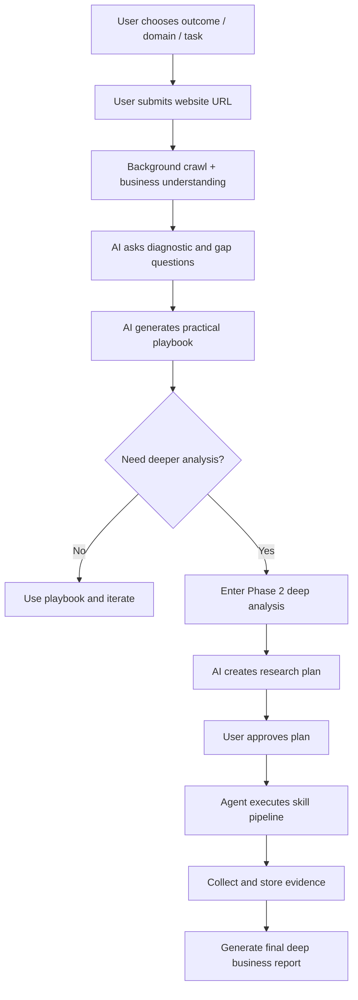
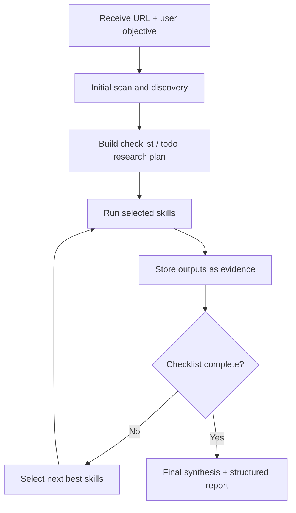

# Product Implementation Overview

This document explains, in product language, how the system works end-to-end: from user onboarding to AI playbook generation and deep business analysis.

---

## What This Product Does

The product helps a business owner move from a vague growth problem to an actionable, evidence-based strategy.

It works in **two layers**:

1. **Guided onboarding + playbook** (fast, focused recommendation path)
2. **Deep analysis agent** (broader market and competitor intelligence path)

Both layers are connected, so users can start simple and go deeper when ready.

---

## Phase 1: Guided Onboarding and Playbook

This is the structured assistant experience.

### Step 1: Problem Scope Selection

The user selects:
- desired outcome (for example: lead generation, retention, strategy, operations)
- business domain
- specific task/problem

This gives the AI initial intent and business context.

### Step 2: Business URL Input

The user shares website URL (or profile URL).

As soon as URL is submitted:
- background website crawl begins
- system starts collecting business signals early

### Step 3: Clarifying Questions

The AI asks:
- scale questions
- diagnostic questions
- precision/gap questions when needed

Purpose: reduce ambiguity before recommendations.

### Step 4: Playbook Generation

Once enough context is collected:
- AI creates a practical playbook
- output is streamed live (token by token)
- user gets descriptive, step-by-step recommendations to improve growth

---

## Phase 2: Deep Analysis Entry

If the user wants deeper market intelligence, they can enter deep analysis.

The system opens the deep-analysis workspace with:
- selected research agent
- user business URL and intent pre-filled as initial context

This starts the agentic pipeline.

---

## Phase 2 Architecture: Plan-First Agentic System

Deep analysis runs in two major stages:

1. **Plan Creation**
2. **Plan Execution (after approval)**

### 1) Plan Creation (AI prepares a research blueprint)

Before running long research, the AI drafts a plan.

It first gathers initial evidence:
- business scan
- homepage-level extraction
- platform scouting (category/scope/market lens)
- web search (reviews, listings, competitors, external mentions)

Then it creates:
- a markdown plan
- checklist/todo style tasks
- inferred business profile (market/scope/region assumptions)

User sees this plan and can **Approve** or **Cancel**.

### 2) Plan Execution (after user approval)

When approved, the agent executes the plan pipeline, typically including:
- deeper website crawl (bounded depth/page limits)
- market/platform scouting
- web discovery
- taxonomy and classification of discovered links
- targeted evidence collection

Throughout execution:
- progress is streamed live
- each skill call is logged
- outputs are stored in structured form

---

## Skill-Based Agent Model (How the AI "works")

The deep-analysis agent does not rely on a single model call.
It uses a **tool/skill ecosystem**.

### Core concepts

- **Allowed skill set:** each agent has controlled tools it can use
- **Skill routing:** AI decides which tool(s) to run next based on current evidence
- **Parallelism:** independent skills can run together (up to a bounded small set)
- **Evidence-first behavior:** decisions are based on collected data, not guesswork
- **Stopping condition:** loop ends when enough evidence is collected for synthesis

### Typical skills used

- on-site scanning/crawling
- platform discovery
- web search
- link taxonomy/classification
- review/listing collection
- social/sentiment skills (where relevant)

---

## Data and Traceability

The system is designed for auditability and reliability:

- conversation and plan states are persisted
- every skill call stores input, progress, and result
- streamed summaries convert raw extractions into readable evidence
- token/model usage is tracked
- plans can run in background and be resumed safely

This makes the AI process inspectable, reproducible, and debuggable.

---

## Final Report Generation

After research steps complete:

- all skill outputs are merged into a single context
- final formatter applies business-analysis output rules
- response is generated as a structured growth report

The final output is intended to be:
- practical
- evidence-backed
- action-oriented
- aligned to business type and market context

---

## End-to-End Product Flow

## Agentic Deep Analysis Flow

---

## Why This Implementation Is Strong

- It combines guided UX (easy for users) with agentic depth (powerful for analysis).
- It keeps humans in control via plan approval.
- It balances speed (parallel skill execution) and quality (evidence-first checks).
- It preserves full execution trace for trust and product iteration.

In short: this is a production-style AI growth intelligence system, not just a single chat prompt.

